# General pretrained visual models 2020-2022

OpenAI CLIP
-----------

_Feb 2021, ICML_

**Data**: 400M text+img

**Model:** [https://github.com/openai/CLIP](https://github.com/openai/CLIP) (pip install clip), [HuggingFace](https://huggingface.co/docs/transformers/v4.25.1/en/model_doc/clip#overview)

**Paper:** [https://arxiv.org/abs/2103.00020](https://arxiv.org/abs/2103.00020)

  

Google ViT
----------

_Oct 2020, ICML_

.png)

**Data:** 300M images (JFT + ImageNet)

**Model:** [HuggingFace](https://huggingface.co/docs/transformers/model_doc/vit), [google-github](https://github.com/google-research/vision_transformer), timm

**Paper:** [https://arxiv.org/abs/2010.11929](https://arxiv.org/abs/2010.11929) (An Image is Worth 16x16 words)

  

Facebook ConvNeXt
-----------------

_Jan 2022_

_The paper claims ConvNeXt outperforms ViT and Swin_

.png)

**Model:** [facebook-git](https://github.com/facebookresearch/ConvNeXt), [HuggingFace](https://huggingface.co/docs/transformers/main/en/model_doc/convnext), timm

**Paper:** [https://arxiv.org/abs/2201.03545](https://arxiv.org/abs/2201.03545)

  

Microsoft BEiT
--------------

_Aug 2022, ICLR_

.png)

**Multi-SotA (BeIT-v3)**

**Data (v1):** ImageNet-22k (14M images)

**Model v1:** [HuggingFace](https://huggingface.co/models?sort=downloads&search=beit), [github](https://github.com/microsoft/unilm/tree/master/beit), [timm](https://github.com/rwightman/pytorch-image-models)

**Model v2:** timm

**Paper:** [beit-v1](https://arxiv.org/abs/2106.08254) [beit-v2](https://arxiv.org/abs/2208.06366) [beit-v3](https://arxiv.org/abs/2208.10442)

  

**Microsoft Swin v2**
---------------------

_Nov 2021, CVPR (2022)_

.png)

**Data:** ImageNet-22k, fine-tune COCO, ADE20k, etc (downstream tasks)

**Model:** [microsoft-git](https://github.com/microsoft/Swin-Transformer), [HuggingFace](https://huggingface.co/docs/transformers/main/en/model_doc/swinv2), timm

**Paper:** [Swin](https://arxiv.org/abs/2103.14030), [Swin-v2](https://arxiv.org/abs/2111.09883)

  

Google MaxViT
-------------

_Apr 2022, ECCV_

_Hybrid (CNN + ViT) with Grid Attn_

.png)

**Model:** [google-git](https://github.com/google-research/maxvit), timm

**Paper:** [https://arxiv.org/abs/2204.01697](https://arxiv.org/abs/2204.01697)

  

Facebook FLAVA
--------------

Dec 2021 - Mar 2022, CVPR

.png)

**Multimodal**

**Data**: 70M, text / image / text+img _(only publicly available data is used)_

**Model**: [https://flava-model.github.io/](https://flava-model.github.io/)

**Paper**: [https://arxiv.org/abs/2112.04482v3](https://arxiv.org/abs/2112.04482v3)

  

**Facebook DeiT**
-----------------

_Jan 2021_

_Data efficient ViT fine-tuning with distillation_

**Model:** [facebook-git](https://github.com/facebookresearch/deit),[HuggingFace](https://huggingface.co/docs/transformers/model_doc/deit)

**Paper:** [https://arxiv.org/abs/2012.12877](https://arxiv.org/abs/2012.12877)

  

**EVA**
-------

_Nov 2022_

_A foundation model that shows quantitative to qualitative changes in transfer learning._

_1B params_

**Model:** [official-git](https://github.com/baaivision/EVA), [timm](https://github.com/rwightman/pytorch-image-models#dec-8-2022)

**Paper:** [https://arxiv.org/abs/2211.07636](https://arxiv.org/abs/2211.07636)

  

Stable Diffusion
----------------

.png)

**SD = CLIP's text Enc. + VAE + UNet** under **diffusions!**

  

**Google ALIGN**
----------------

_Feb 2021, ICML_

_Didn't beat the CLIP_

**Model:** N/A

**Data:** 700M text+img (COYO dataset)

**Paper:** [https://arxiv.org/abs/2102.05918](https://arxiv.org/abs/2102.05918)

  

**InternImage; M3I**
--------------------

_Nov 2022_

**Model:** N/A (not released yet)

**Paper:** [https://arxiv.org/abs/2211.05778](https://arxiv.org/abs/2211.05778)

  

**Google SimVLM**
-------------------

_Aug 2021, ICLR_

**Model:** N/A (not released yet)

**Paper:** [https://arxiv.org/abs/2108.10904](https://arxiv.org/abs/2108.10904)

* * *  

# Example queries from models

**The most left image is a query. We are trying to find top-5 nearest images from the dataset using models' embedding latent spaces.**

## Stanford-cars

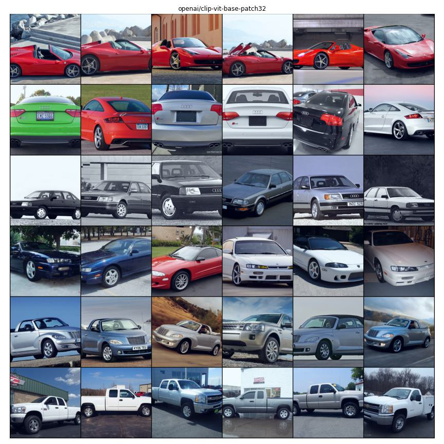

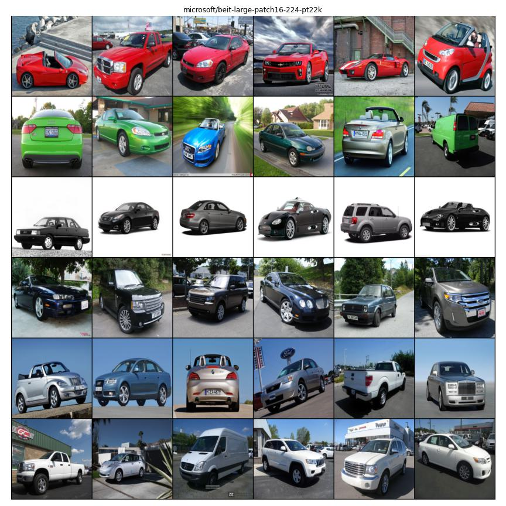

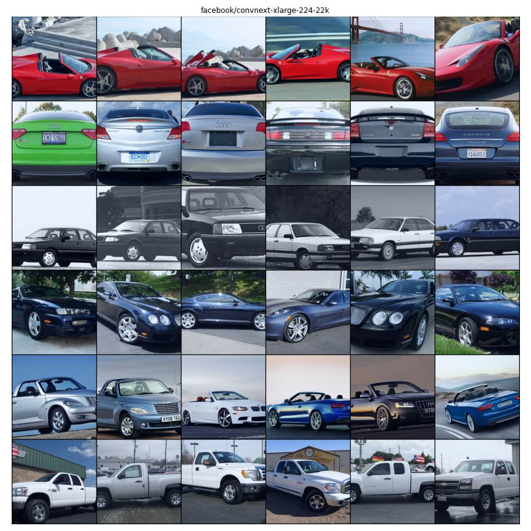

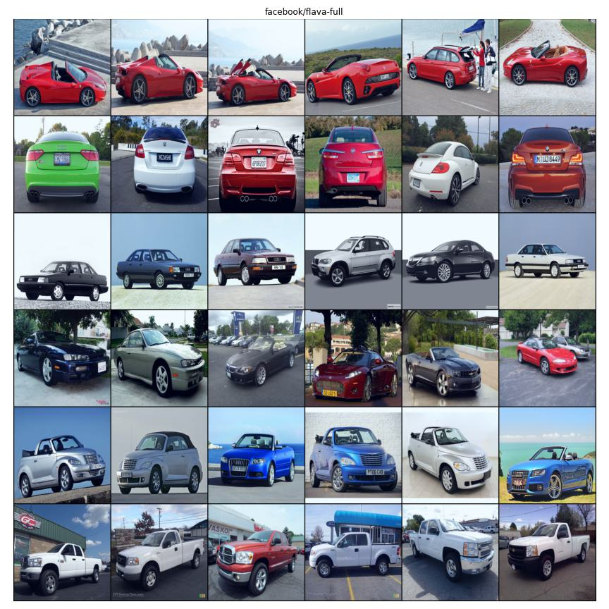

## Stanford-products
---

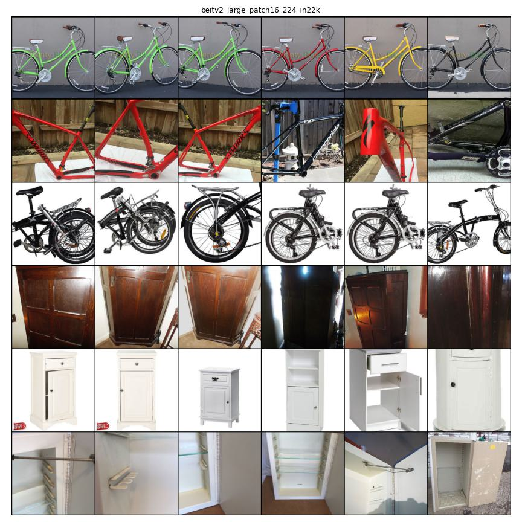

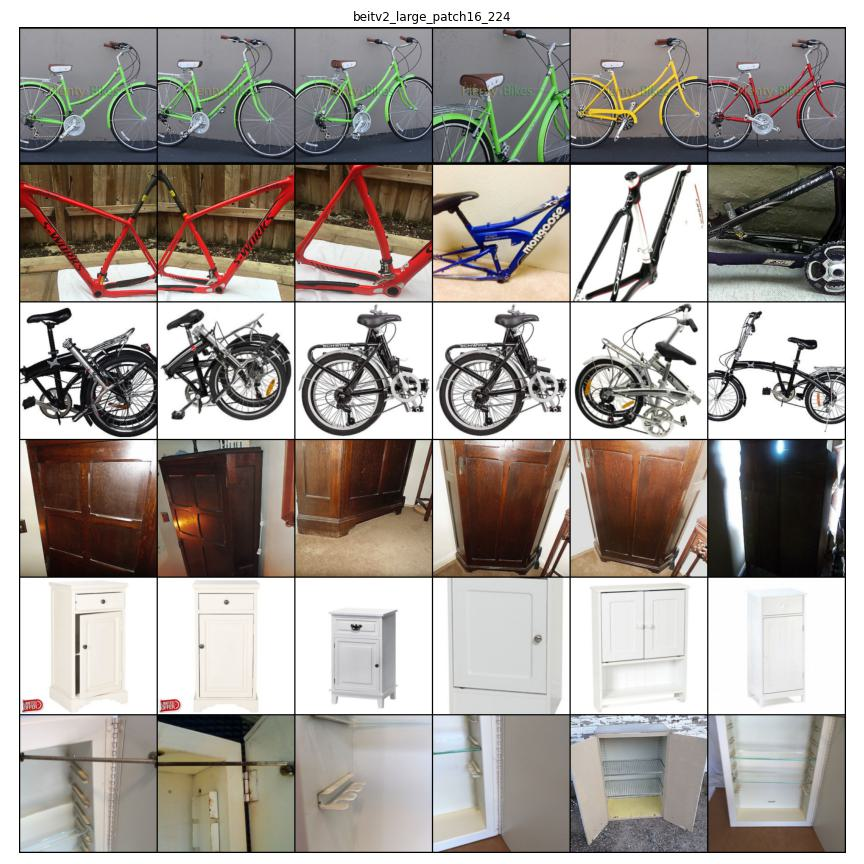

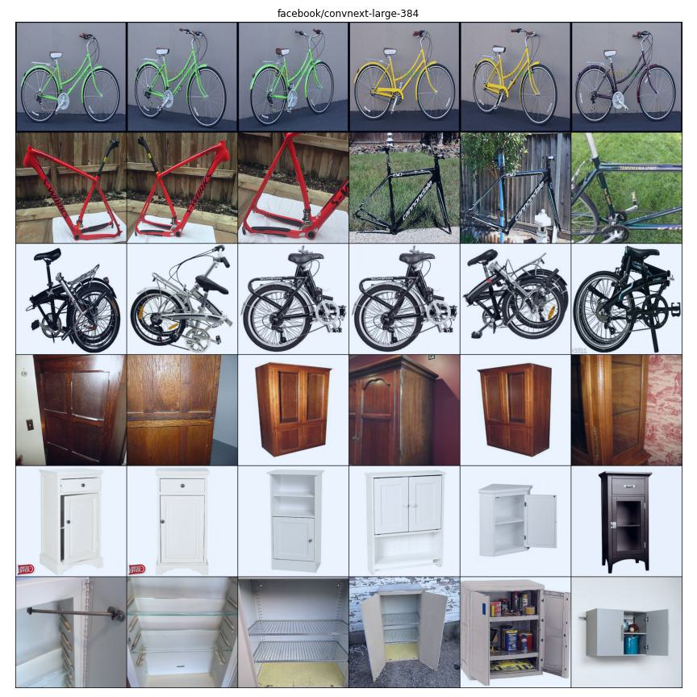

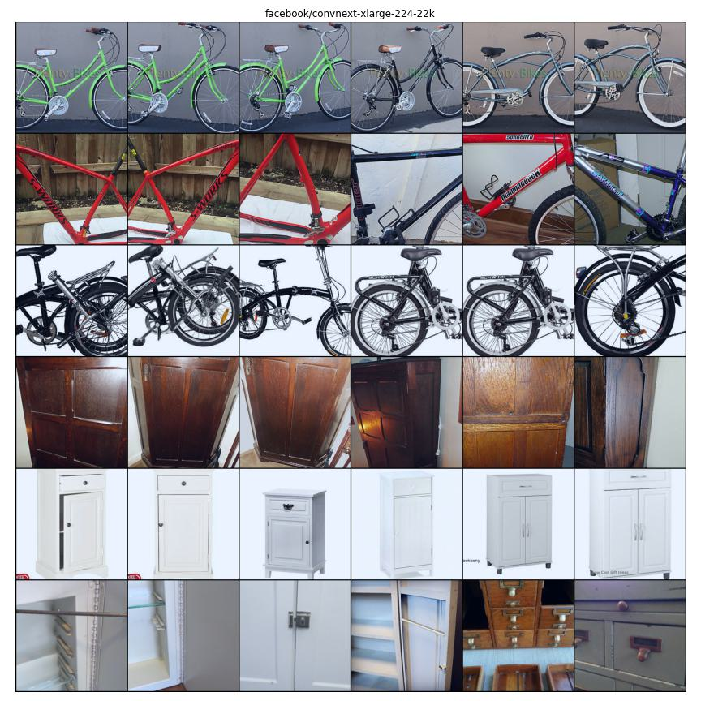

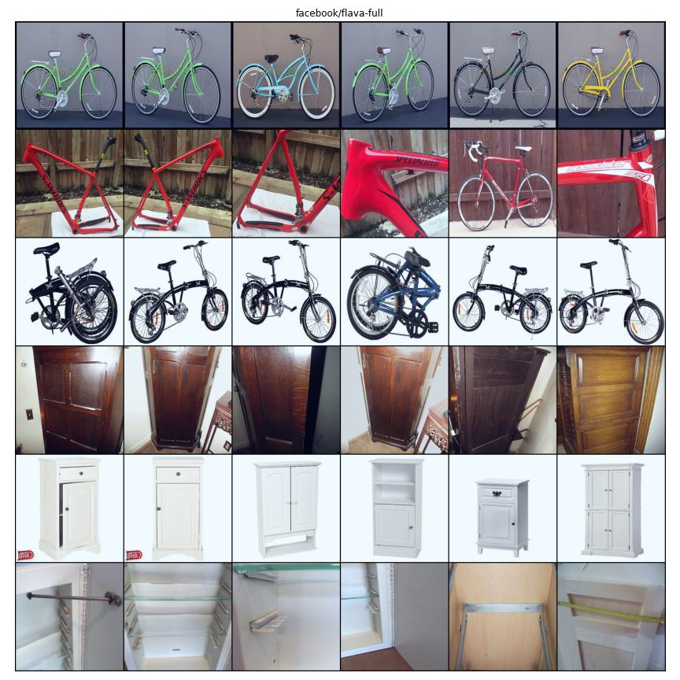

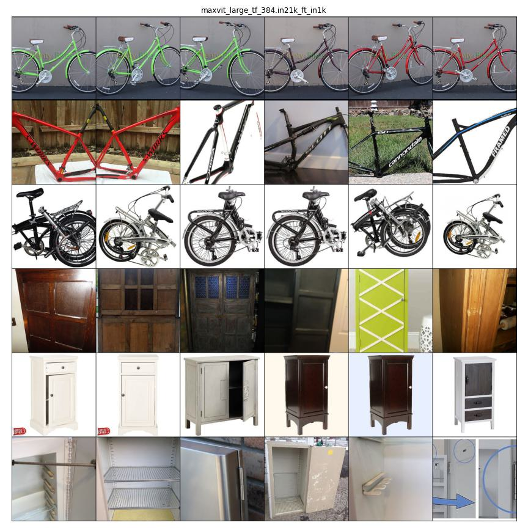

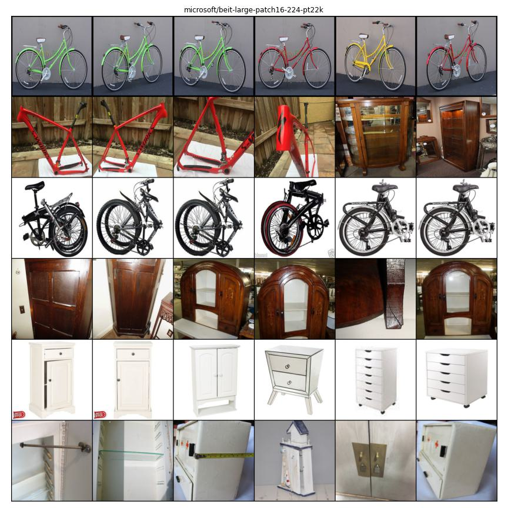

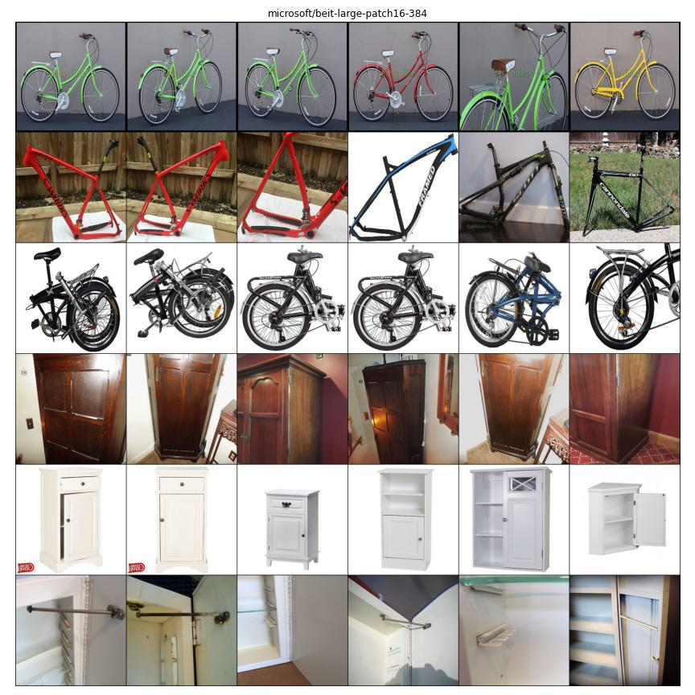

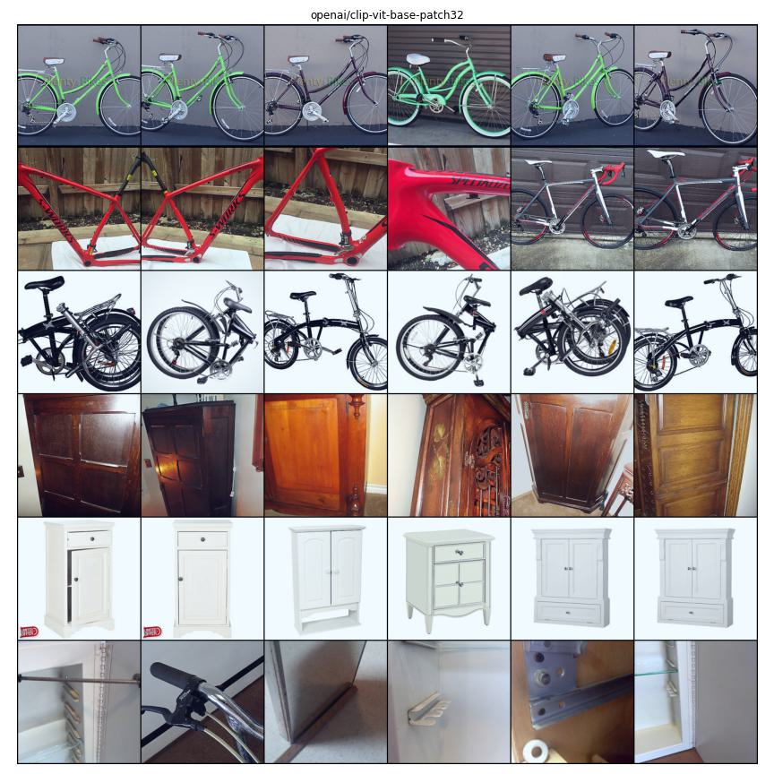

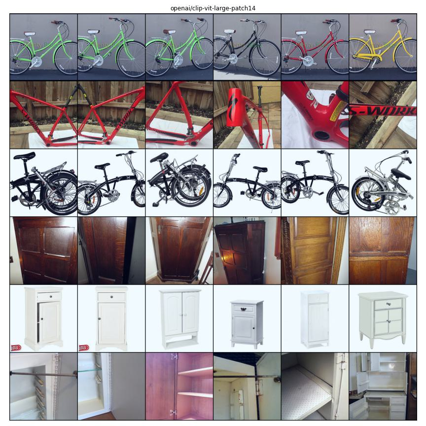

---
## other models to check:
* * *

ViLT VQA

vit-gpt2 [https://huggingface.co/nlpconnect/vit-gpt2-image-captioning](https://huggingface.co/nlpconnect/vit-gpt2-image-captioning)

DALL-E Decoder (dVAE image tokenizer): Zero-shot text-to-image generation

  

**ImageNet**:

CoCa

DaViT

Florence

Efficient Net
